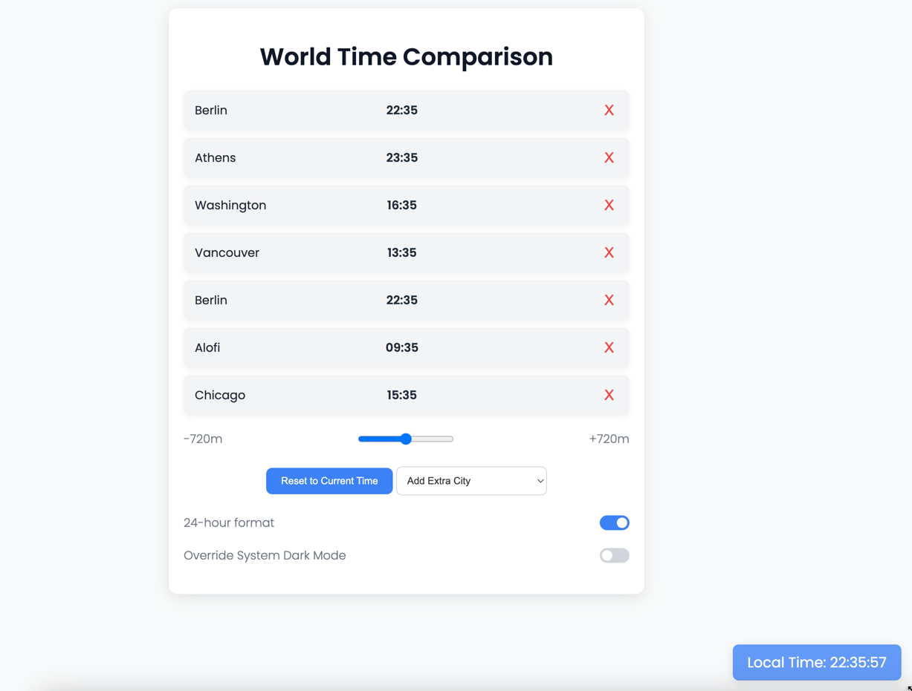

# World Time Comparison

World Time Comparison is a web application that allows users to compare the current time in multiple cities around the world. The application also features a floating "Local Time" clock that updates in real-time and supports both light and dark modes.

## Features

- Add and remove cities from the comparison list.
- Adjust the time offset to see future or past times.
- Toggle between 24-hour and 12-hour time formats.
- Override system dark mode to switch between light and dark themes.
- Floating "Local Time" clock that updates every second.

## Screenshots


## Installation

1. Clone the repository:
   ```sh
   git clone https://github.com/yourusername/world-time-comparison.git
   ```
2. Navigate to the project directory:
   ```sh
   cd world-time-comparison
   ```
3. Open `index.html` in your preferred web browser.

## Usage

1. Use the "Add Extra City" dropdown to select and add cities to the comparison list.
2. Adjust the time offset using the slider to see times in the past or future.
3. Use the toggle switches to change between 24-hour and 12-hour formats and to override the system dark mode.
4. The floating "Local Time" clock at the bottom right corner updates every second.

## Technologies Used

- HTML
- CSS
- JavaScript

## Contributing

Contributions are welcome! Please follow these steps to contribute:

1. Fork the repository.
2. Create a new branch:
   ```sh
   git checkout -b feature-branch
   ```
3. Make your changes and commit them:
   ```sh
   git commit -m "Add feature"
   ```
4. Push to the branch:
   ```sh
   git push origin feature-branch
   ```
5. Create a pull request.

## License

This project is licensed under the MIT License. 

## Acknowledgements

- Inspired by various world time applications and UI design principles.
- Special thanks to all contributors and users.

## Contact

For any inquiries or feedback, please contact [redcat42@black.com](mailto:redcat42@black.com).

---

© 2023 All rights reserved.
